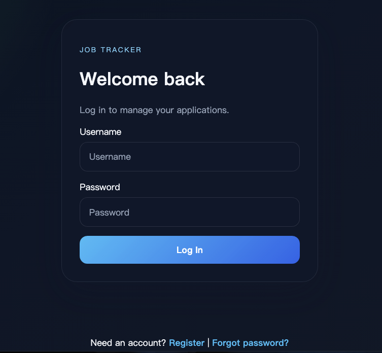
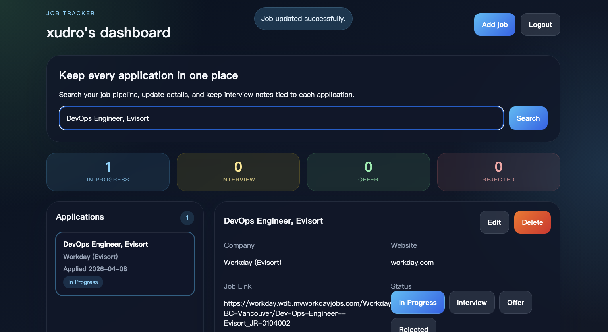

# Job Tracker App

A full-stack job tracker built with React, Flask, and MySQL, developed as a DevOps portfolio project focused on Docker, AWS, CI/CD, and Terraform.

## Screenshots





## Overview

This project started as a job tracking application and is being expanded into an end-to-end DevOps showcase project. The goal is to demonstrate both application development and infrastructure/deployment skills in a practical, interview-ready way.

## Tech Stack

- Frontend: React + Vite
- Backend: Flask
- Database: MySQL
- DevOps roadmap: Docker, AWS, GitHub Actions CI/CD, Terraform, monitoring

## Current Features

- User registration and login
- Session-based authentication
- Password reset using `username + birth_date + new password`
- Job CRUD operations
- Job search
- Application status tracking:
  - `in_progress`
  - `interview`
  - `offer`
  - `rejected`
- Dashboard list shows `title + company`
- Status can be updated directly from the detail panel

## Project Goal

This repository is being built as a portfolio project for DevOps / Cloud Engineering roles. The implementation plan is:

1. Build and run the app locally
2. Containerize it with Docker
3. Deploy it to AWS
4. Add CI/CD with GitHub Actions
5. Provision infrastructure with Terraform
6. Add observability with Prometheus and Grafana

## Project Structure

- `frontend/`: React + Vite client
- `backend/`: Flask JSON API
- `database/schema.sql`: MySQL schema
- `.env`: backend environment variables for local development

## Local Development

### Backend

```bash
cd backend
python3 -m venv .venv
source .venv/bin/activate
pip install -r requirements.txt
python app.py
```

The backend runs on `http://127.0.0.1:5001`.

### Frontend

```bash
cd frontend
npm install
npm run dev
```

The frontend runs on `http://localhost:5173/` and proxies `/api` requests to the Flask backend.

## Database

Create the schema from:

- `database/schema.sql`

If you already created the older local schema, run these statements once:

```sql
USE job_tracker;

ALTER TABLE users
ADD COLUMN birth_date DATE NOT NULL DEFAULT '2000-01-01';

ALTER TABLE jobs
ADD COLUMN status VARCHAR(32) NOT NULL DEFAULT 'in_progress';
```

## API Endpoints

- `GET /api/health`
- `GET /api/session`
- `POST /api/register`
- `POST /api/login`
- `POST /api/reset-password`
- `POST /api/logout`
- `GET /api/jobs?q=keyword`
- `POST /api/jobs`
- `GET /api/jobs/<id>`
- `PUT /api/jobs/<id>`
- `DELETE /api/jobs/<id>`

## Notes

- `.env` is required for backend configuration and should not be committed
- This project is actively evolving from an application project into a full DevOps portfolio project
